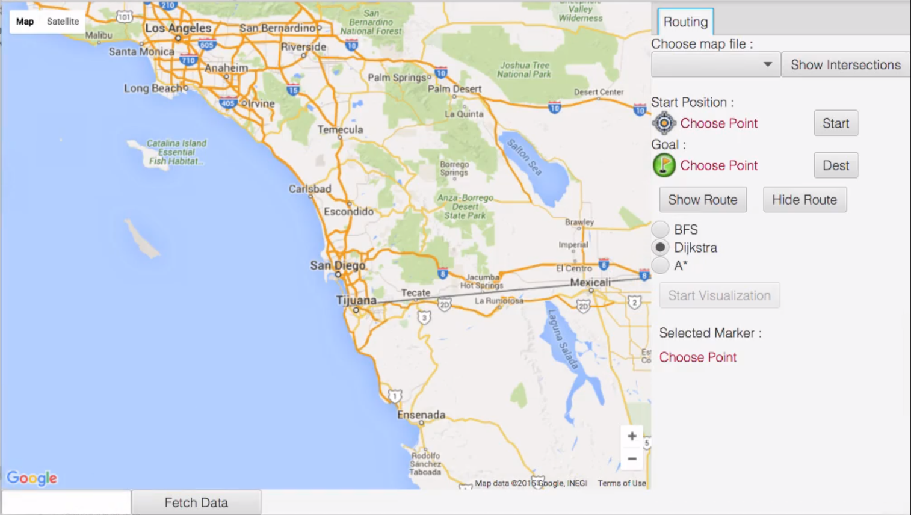
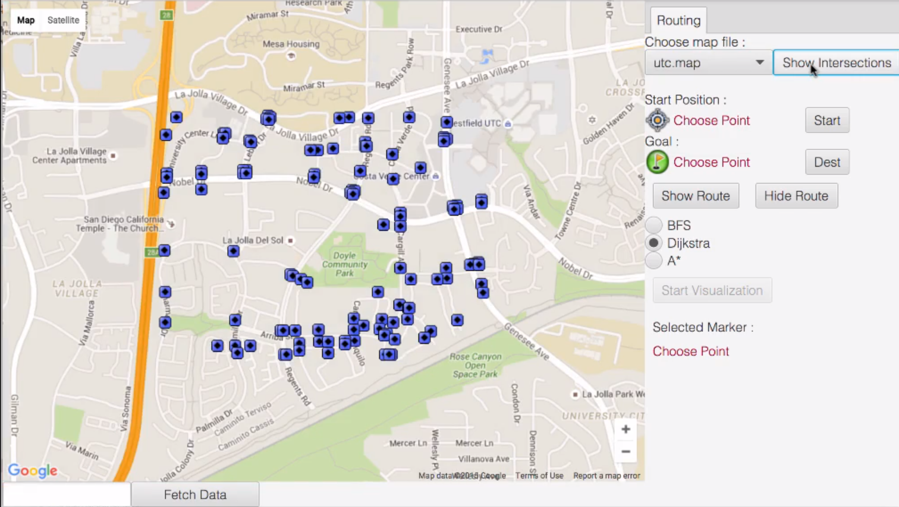
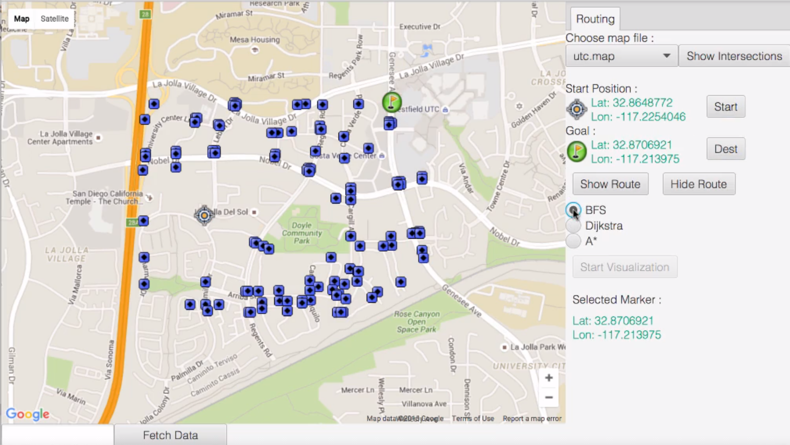
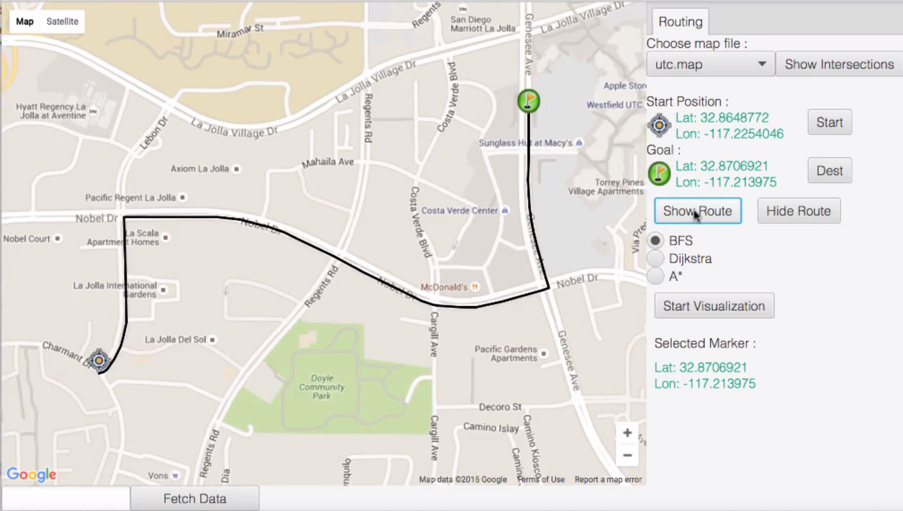
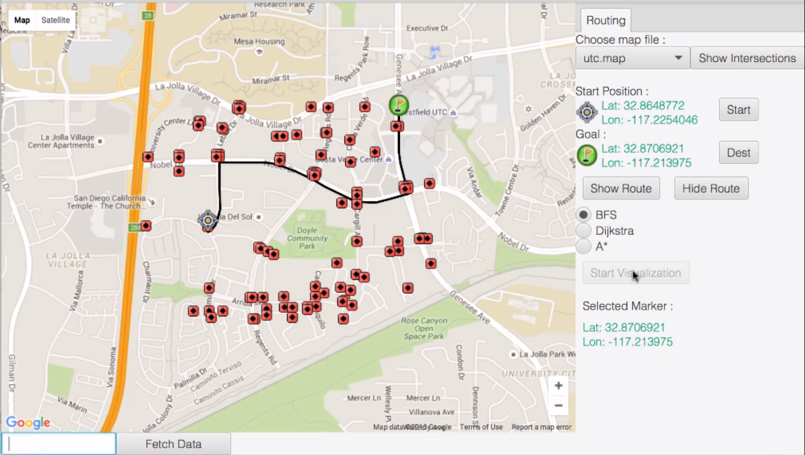

## Coursera - Advanced Data Structures in Java By University of California, San Diego 

#### Instructors: Mia Minnes, Leo Porter and Christine Alvarado

**Course Link -** https://www.coursera.org/learn/advanced-data-structures

**Certificate Credentials -** https://www.coursera.org/account/accomplishments/certificate/LSJJSGDSFTRF

## Course Description

This is an intermediate Java course. The main goal is to learn about Advanced Data Structures used in structuring of real world data. We will also learn develop, implement, and analyze algorithms for working with this data to solve real world problems. And this course is project-based, so by the end of this course we will have completed a cool project.

## Course Modules 

1. Introduction to the Course.
2. Introduction to Graphs.
3. Class design and simple graph search.
4. Finding shortest paths in weighted graphs.
5. Route planning and NP-hard graph problems.
6. End of Course Project Extension.

## Tasks Completed

1. Learned and implemented Graph abstract data type (ADT).
2. Created graphs in Java using an adjacency matrix representation and an adjacency list representation.
3. Analyzed and implemented Depth-first Search (DFS) and Breadth-first search (BFS) on a graph.
4. Analyzed and implemented Dijkstra's Algorithm and A* search algorithm on graph.
5. Analyzed working and running time for Travelling Salesman Problem(TSP), NP-Hard Problems, Hamiltonian and Eulerian graphs.
6. Implemented different graph algorithms in java application to find the route between two location points based on real world map data.

## Project Screenshots

 

 